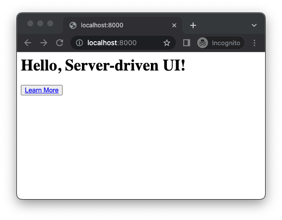

# Server-driven UI Toy

A repository to play with server-driven UI concepts.

## Development

- Install the [Deno](https://deno.land/manual/getting_started/installation)
  JavaScript runtime.
- In a terminal, git clone this repository and run the command `deno task dev`.
- In a web browser, visit `http://localhost:8000`.

## Research

### Why Do Companies Use Server-driven UI?

1. Faster mobile app releases
2. Application CMS

#### Faster Mobile App Releases

Mobile app releases typically take on the order of weeks with a long-tail of
upgrades occurring over a period of months thus slowing down the rate of change
with the UI. SDUI attempts to solve this problem by storing the UI on the
backend to decouple UI changes from mobile app releases.

For companies like Airbnb[^1] and Shopify[^2], being able to iterate on the UI
faster is the core value proposition of SDUI.

#### Application CMS

SDUI can also allow non-technical employees to update content. Thus unlocking
faster content updates, and automating away mundane developer tasks.

### How Do We Design a Server-driven UI System?

Airbnb and Shopify have very similar SDUI systems which consist of:

1. a backend that provides the UI and data required to render that UI.
2. a client framework that can render the backend response for each supported
   client.
3. a mechanism for developers to modify server components such as config files
   or a WYSIWYG editor.

### Further Design Questions

- How narrow or wide is the scope of our SDUI system?
- Which clients do we want to support (e.g. web, iOS, Android)?
- Do we want to support advanced client capabilities such as click events, and
  analytics?
- How easy or hard is it for developers to modify server components?

[^1]: [A Deep Dive into Airbnb’s Server-Driven UI System](https://medium.com/airbnb-engineering/a-deep-dive-into-airbnbs-server-driven-ui-system-842244c5f5)

[^2]: [Implementing Server-Driven UI Architecture on the Shop App](https://shopify.engineering/server-driven-ui-in-shop-app)
